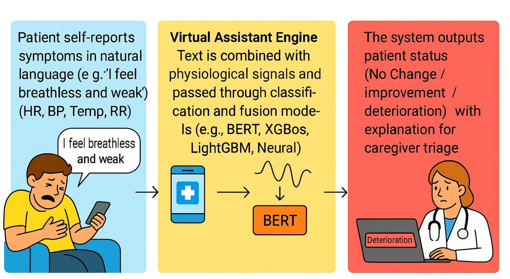
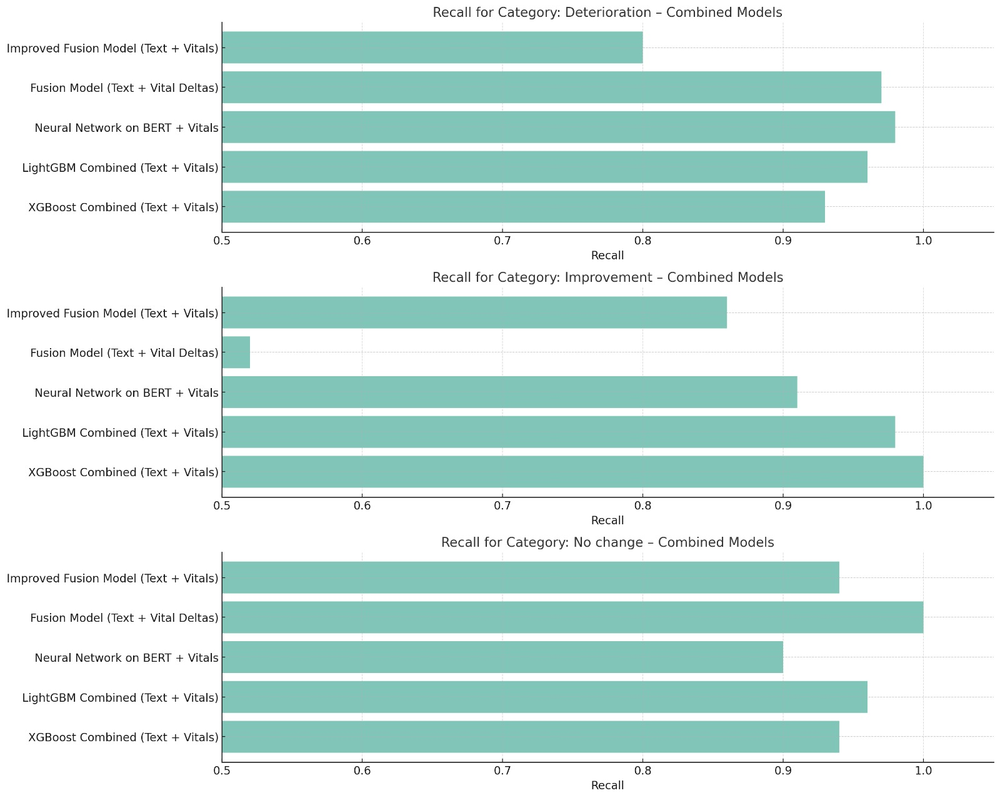
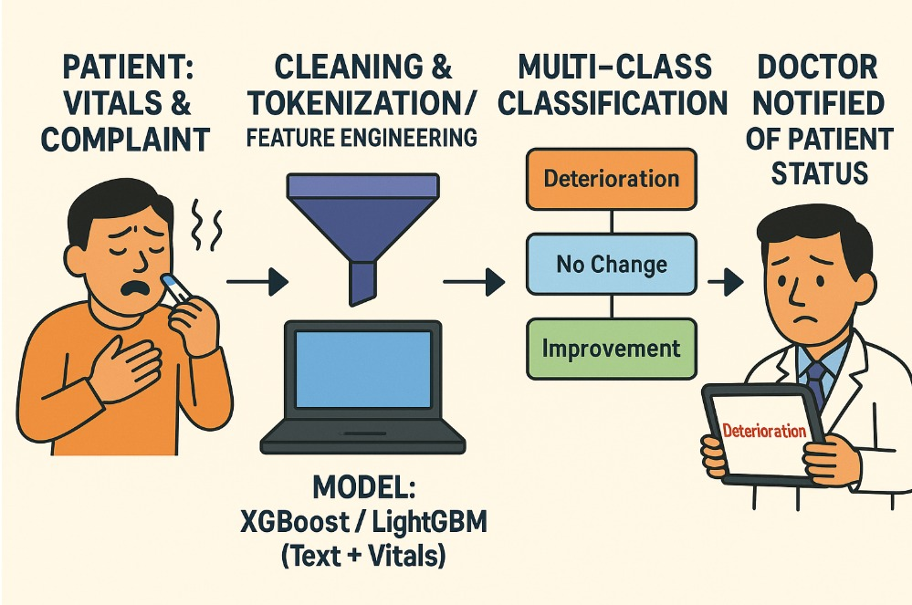

# Virtual Care Assistant for Home Hospitalization

## Project Overview
This project presents an AI-powered assistant designed to support remote clinical decision-making in home hospitalization settings. The system processes patient-reported symptom descriptions in natural language, along with physiological vital signs, to predict the patient’s current status:
- No Change  
- Improvement  
- Deterioration
  
The assistant is intended to improve early detection of clinical deterioration in situations where no medical staff is physically present.

## Objectives
- Extract clinically relevant information from unstructured text.
- Integrate physiological data to enhance prediction accuracy.
- Build a real-time decision-support model combining NLP and tabular data.

## Dataset (Synthetic)
In this project, we synthetically generated a dataset using GPT-based prompting to simulate realistic home hospitalization cases.
- Text: Free-text symptom descriptions written in natural, informal language.
- Vitals: Changes in heart rate, respiratory rate, temperature, and blood pressure (Day 2 – Day 1).
- Labels: Manually assigned clinical outcomes (0 = No Change, 1 = Improvement, 2 = Deterioration).

A fully synthetic dataset was generated using Python code that models typical symptom–vital patterns observed in home care.  
Each sample includes free-text symptom descriptions and structured vitals (HR, RR, Temp, BP deltas), returned in JSON format and converted to tabular form.
The dataset reflects realistic class distributions and input noise, making it suitable for training and evaluating classification and multimodal fusion models.
 
You can view or download the dataset here:  
[patient_dataset.csv](data/patient_dataset.csv)

Data was generated using this notebook:  
[care_giver_data_generation.ipynb](notebooks/care_giver_data_generation.ipynb)

## Tasks Performed

### Exploratory Data Analysis (EDA)
- Label distribution
- Text length distribution
- Distribution and correlation of vital signs
- Boxplots and violin plots grouped by label
- Word clouds for each class

### Preprocessing
- Text cleaning (punctuation, stopwords, lowercasing)
- Delta feature creation for vitals
- Missing value imputation
- Feature scaling

### Modeling

We experimented with the following model families:

- **Text-only models**
  - TF-IDF + Logistic Regression
  - BERT-based classification

- **Vitals-only models**
  - XGBoost
  - LightGBM

- **Fusion models (Text + Vitals)**
  - Classical ML: XGBoost, LightGBM, Random Forest
  - Neural Networks:
    - Simple NN with BERT embeddings and vitals
    - Improved NN with deeper layers, Batch Normalization, Dropout, and learning rate tuning

## Evaluation Metrics
- Accuracy
- F1 Macro
- Recall
- Cross-validation for generalization
- Test set evaluation

###  Best Performing Model:

| Model Name          | Accuracy | F1 Macro |
|---------------------|----------|----------|
| LGBM_Combined_Test  | 0.971    | 0.972    |

#### Per-Class Recall – Top 5 Fusion Models

## Visualizations
- Comparison plots of model performance
- Confusion matrices
- Feature distributions and correlations
- Text-based analyses (lengths, word clouds)

## Key Insights
- Fusion of structured (vitals) and unstructured (text) data led to superior performance.
- BERT improved understanding of nuanced symptom descriptions.
- Model enhancements like Batch Normalization and Dropout increased model robustness.

## Future Work
- Use real clinical datasets (e.g., MIMIC-IV, sensor logs).
- Implement Named Entity Recognition (NER) and triage reasoning.
- Integrate the system into a conversational chatbot interface.

## Technologies Used
- Python, Pandas, Scikit-learn
- TensorFlow, Keras
- HuggingFace Transformers (BERT)
- XGBoost, LightGBM
- Seaborn, Matplotlib
  
## Prior Research & Related Work
Our project was inspired by recent advances in clinical NLP and deterioration detection that combine unstructured text with structured physiological signals. The following studies guided our design choices and model architecture:

### Studies:

- **Nature Digit. Med., 2021**  
  *Deep learning for early warning of inpatient deterioration*  
  Used attention-based LSTM on minute-level vitals to predict deterioration up to 12 hours in advance.  

- **J. Gen. Intern. Med., 2023**  
  *Fusion of clinical notes and vitals using BERT + MLP*  
  Showed improvement in macro-F1 when combining notes with vitals.  

- **PMC, 2019**  
  *Combining vital signs and free-text for deterioration detection*  
  Demonstrated the effectiveness of text features like “pain”, “fatigue” and LightGBM fusion.  

## Authors
Gabrielle Maor  
Shay Sason  
HIT – Digital Health Technologies  
NLP & LLM Final Project (2025)

